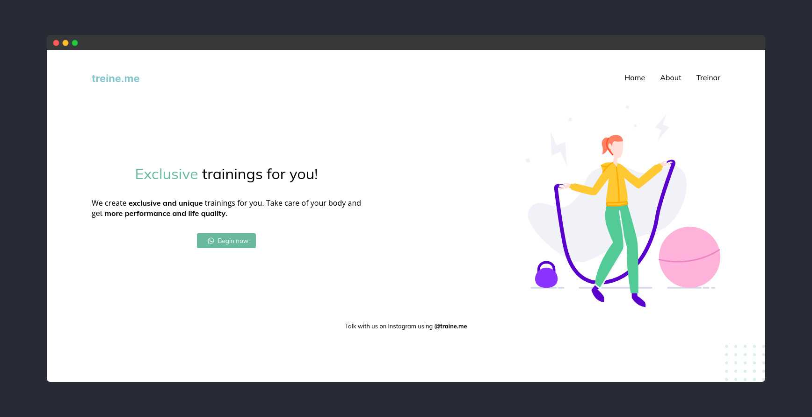

# treine.me

## Resources

- [HTML](https://www.latex-project.org/)
- [CSS](https://github.com/liantze/AltaCV)

## Content language

- English

## About

This is a fully responsive landing page of a gym. It's part of [Rocketseat's Explorer Bootcamp](https://www.rocketseat.com.br/explorer).

## Run

Install [Live Server extension](https://marketplace.visualstudio.com/items?itemName=ritwickdey.LiveServer), right click on `index.html` file and then click on `Open with Live Server`.

## Contributing

- Fork this repository;
- Clone to your machine;
- Create a branch like:
  - `feature/description`
  - `bugfix/description`
- Commit your code;
- Submit a pull request and wait until is reviewed;

## Status

Done ✅

## License

[MIT](./LICENSE)
